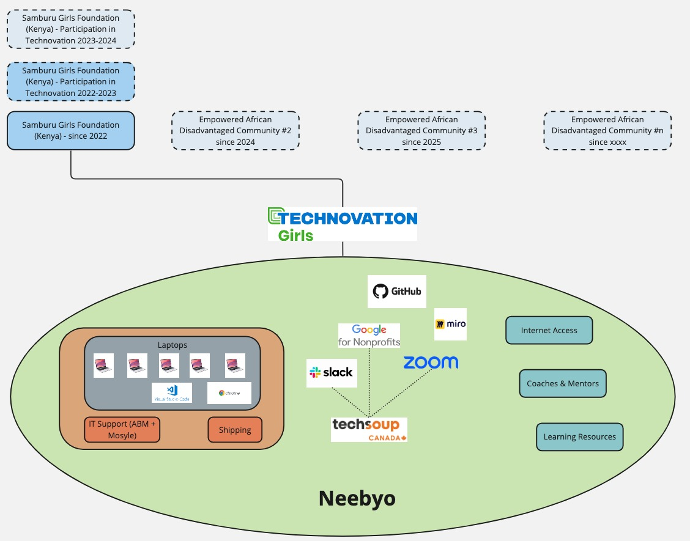

A not-for-profit initiative that aims to raise digital awareness among disadvantaged communities in rural areas of Africa.

### Mission
Raise digital awareness among disadvantaged communities in rural areas of Africa.

### Vision
We envision African youth in disadvantaged areas solving problems in their community with technology.

### Strategy
Empower youth in disadvantaged communities to regularly participate in coding programs like [Technovation](https://www.technovation.org/) by taking care of the heavy lifting (facilitate access to laptops, internet, IT Support, coaches and mentors, learning resources, communication and collaboration tools).

### Goals
- Increase the proportion of youth from disadvantaged communities who participate in coding programs like Technovation every year.
- Increase the proportion of mentors from disadvantaged communities

### Roadmap
Empower a new disadvantaged community every year.

## Get in touch
- [LinkedIn](https://www.linkedin.com/company/neebyo/)
- [Twitter](https://twitter.com/neebyo)
- [Instagram](https://www.instagram.com/neebyo_org/)
- [Facebook](https://www.facebook.com/neebyo)